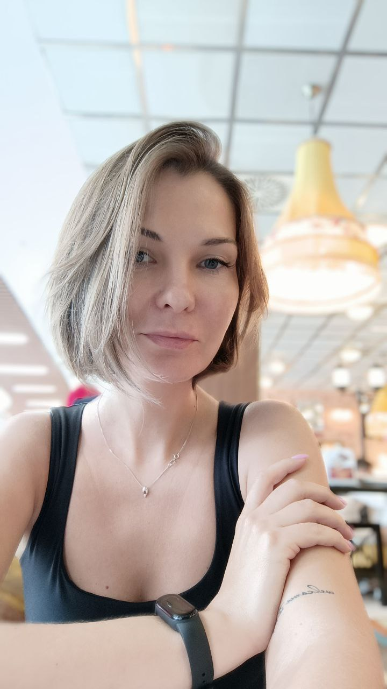

# Evgeniya Chernyavskaya



### Junior Frontend Developer

---

### Contact information

- **Address:** Moldova, Bendery Tkachenko st., 12, apt. 21
- **Phone:** +373 78866917
- **E-mail:** [chev640@gmail.com](chev640@gmail.com)
- **Telegram:** [ChernyavskayaEvgenia](https://t.me/ChernyavskayaEvgenia)
- **GitHub:** [ChernyavskayaEv](https://github.com/ChernyavskayaEv)
- **CodePen:** [ChernyavskayaEv](https://codepen.io/chernyavskayaev)
- **Discord:** [@EvgeniaCr#8943](@EvgeniaCr#8943)

---

### Short history about me

I have worked in the power industry all my life. I climbed the career ladder from engineer to chief engineer, but at the age of 40 I decided to change my life and start everything from scratch. I want to change the field of work and become an IT developer. I think my previous work experience will help me achieve my goal in a short time.

Assembled, balanced, competently organize the workflow. I have experience in personnel management. I know how to focus on the task at hand to achieve the result. I have a high capacity for work and an analytical mindset.

---

### Skills

| Personal:        | Professional: |
| ---------------- | ------------- |
| Communicative    | HTML5         |
| Teamwork         | CSS3, SASS    |
| Time Management  | JavaScript    |
| Analytical Skill | TypeScript    |
| Multitasking     | NODE.JS       |
| Stress Tolerance | PostgreSQL    |
| Attentiveness    |
| Forethought      |

---

### Code examples

```
const isIsogram = (x) => {
  let array = x.toLowerCase().replace(/-|\s/g, '').split('');
  let set = new Set(array);
  return array.length == set.size;
};
```

---

### Education

---

### Experience

---

### Languages
